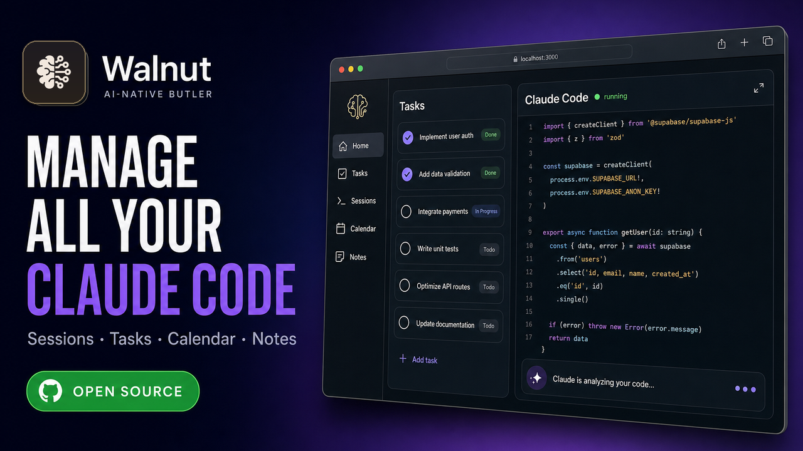

# Open Walnut — Personal AI Butler & Task Manager with Claude Code Web UI

[](LICENSE)
[](https://github.com/EvanZhang008/open-walnut/actions)
[](https://nodejs.org/)
[](https://www.typescriptlang.org/)
[](https://github.com/EvanZhang008/open-walnut)


**An AI agent that manages your projects, notes, and coding sessions — with the missing web UI for Claude Code built in.**

### 🎬 Watch the 3-minute demo

[](https://youtu.be/2MPd-gaYC6s)

> **An open-source home for all your Claude Code — plus notes, tasks, and calendar.** ▶️ [Watch the demo on YouTube](https://youtu.be/2MPd-gaYC6s)

Open Walnut is not just a dashboard — it's an AI-native app. A built-in AI agent with 30+ tools manages your tasks, spawns and monitors Claude Code sessions, and builds a **self-organizing knowledge base** that gets smarter the more you use it. Raw daily observations auto-distill into organized topic pages. Old noise decays. Important patterns persist. It also gives Claude Code a proper web interface: real-time streaming, multi-session monitoring, visual task boards, and a personal notes vault. Think of it as an AI butler with a perfect memory and a beautiful UI.

> **Philosophy**: Open Walnut is human-first. It amplifies *your* productivity — not by building a swarm of agents talking to each other, but by giving *you* superpowers. You stay in control. The AI handles the grunt work, surfaces what matters, and gets out of your way. The goal is simple: make your day smooth, focused, and productive.

## Table of Contents

- [Why Open Walnut?](#why-open-walnut)
- [Screenshots](#screenshots)
- [Key Features](#key-features)
- [Multi-Agent — But Human-Centered](#multi-agent--but-human-centered)
- [Quick Start](#quick-start) | **[Getting Started Guide](GETTING_STARTED.md)**
- [Configuration](#configuration)
- [Web Dashboard Pages](#web-dashboard-pages)
- [CLI](#cli)
- [Project Structure](#project-structure)
- [Development](#development)
- [Tech Stack](#tech-stack)
- [Alternatives](#alternatives)
- [Contributing](#contributing)
- [Star History](#star-history)
- [License](#license)

## Why Open Walnut?

**If you use Claude Code in the terminal**, you've probably felt the pain:
- Sessions disappear when you close the tab. No history, no context.
- You can't see multiple sessions at once.
- There's no way to attach a session to a task and track progress visually.
- You lose the knowledge gained in each session.

**If you use separate apps for tasks, notes, and AI coding**, you've felt this too:
- Context is scattered across Notion, Todoist, Apple Notes, and terminal windows.
- Your AI doesn't know what you're working on. You re-explain everything every time.
- Task completion doesn't capture what was learned or decided.

Open Walnut replaces all of that with one system:

| What you use today | Open Walnut equivalent |
|---|---|
| Claude Code (terminal) | Web UI with real-time streaming, multi-session view, model switching |
| Todoist / Notion projects | 4-layer task hierarchy (Category → Project → Task → Subtask) |
| Apple Notes / Obsidian | Notes vault (wiki-links, backlinks, PARA folders) + agent-maintained memory (daily logs, topics, project memory) |
| Manual AI workflows | 30+ agent tools, cron jobs, automated triage |

## Screenshots

### Talk to the agent, get things done


> "I need to file my tax before this week. Make it high priority and star."
>
> Open Walnut creates the category, project, and task — sets priority, due date, and star — in one shot.

### AI sessions that work for you


> The agent spawns a Claude Code session attached to the task. It runs in plan mode, reports progress, and you can check on it anytime from the session panel.

## Key Features

### Claude Code Web UI
- **Real-time session streaming** — watch tool calls, outputs, and reasoning live in the browser
- **Multi-session dashboard** — run and monitor multiple Claude Code sessions side by side
- **Mid-session model switching** — swap between Opus, Sonnet, and Haiku without losing context
- **Plan → Execute workflow** — sessions produce a plan file for your review, then execute on approval
- **Remote sessions via SSH** — run Claude Code on remote machines with automatic node version detection (nvm, fnm, volta, asdf)
- **Session history & search** — every session is saved, searchable, and attached to a task
- **Focus Bar** — pin active tasks to a dock at the bottom; see live session previews, send messages, switch context in one click

### Project & Task Tracking
- **4-layer hierarchy**: Category → Project → Task → Subtask
- **7-phase lifecycle**: TODO → IN_PROGRESS → AGENT_COMPLETE → AWAIT_HUMAN_ACTION → HUMAN_VERIFIED → POST_WORK_COMPLETED → COMPLETE
- **Rich metadata**: priorities (4 tiers), due dates, dependencies with cycle detection, starred favorites, tags
- **Parent-child tasks**: nested task hierarchies with starred-parent auto-includes-children
- **Drag-and-drop** task reordering within and across projects
- **Natural language task creation** — just tell the agent what you need

### Notes — Your Personal Knowledge Vault
- **Obsidian-style editor** — rich markdown with `[[wiki-links]]`, backlinks, slash commands, and folder tree navigation
- **PARA organization** — Areas, Projects, Resources, Archive folders (or organize however you like)
- **Global Notes** — a quick-capture scratchpad on the home page, always one click away
- **Instructions file** — `notes/AGENTS.md` is injected into every Claude Code session, so the AI always knows your conventions
- **Searchable** — notes are indexed alongside memory for hybrid BM25 + vector search

### Memory — Self-Organizing AI Knowledge

Most AI tools forget everything between sessions. Open Walnut doesn't. Its memory system is designed around one principle: **knowledge should organize itself**. You never file, tag, or maintain anything — the AI captures raw observations in real time, then a background "Dream" agent periodically wakes up and distills them into organized wiki-style topic pages. Old noise fades. Important patterns rise. The result is a knowledge base that **grows cleaner over time, not messier**.

**The auto-distillation cycle:**

```
Real-time                          Background                      Always available
───────────                        ──────────                      ────────────────

Working Memory ◄─── updated        Dream Agent                     Hybrid Search
  7 sections:       every ~5K        wakes every ~24h               ┌─ BM25 keyword
  focus, decisions,  tokens          reads daily logs +             ├─ vector (BGE-M3)
  struggles, ...                     working memory                 ├─ LLM re-ranking
       │                                    │                       └─ query expansion
       ▼                                    ▼
Daily Logs          ──────────►    Topic Files (wiki pages)         temporal decay:
Project Memory      ──────────►      edit-in-place, not append       recent = ranked higher
Repo Memory         ──────────►      knowledge stays current         old noise fades out
Session Summaries   ──────────►    Memory Index (table of contents)  evergreen = no decay
```

- **Working memory** — a live scratchpad with 7 structured sections (Active Focus, Decisions & Rationale, Struggles & Breakthroughs, Open Threads, etc.). A background process updates it every ~5K tokens of conversation. When context gets compacted, working memory *replaces* the traditional LLM summary — saving an API call and preserving richer context. This is why long conversations in Walnut don't lose the plot.

- **Daily logs** — the agent's journal (`memory/daily/YYYY-MM-DD.md`). Written in butler-journal style: user requests in their own words, decisions with rationale, struggles and resolutions, open threads. Not git logs or commit hashes — things you'd actually want to recall two weeks later.

- **Project & repo memory** — scoped knowledge that auto-loads when you work on related tasks. Project memory tracks decisions and context per project. Repo memory stores environment quirks: build commands, conventions, SSH configs, monorepo structure.

- **Dream consolidation** — inspired by how biological memory consolidates during sleep. A background agent wakes up periodically (after ≥24h and ≥5 sessions), reads through recent daily logs, working memory, and compaction archives, then distills them into **topic files** (`memory/topics/*.md`). Topics are updated in-place — contradicted facts get deleted, relative dates become absolute, cross-project patterns get extracted. An **index file** (`memory/index.md`) serves as the wiki table of contents (≤200 lines, always injected into context so the AI knows what it knows).

- **Temporal decay** — not all memories are equal. Search results are weighted by freshness: recent daily logs rank higher than month-old ones (30-day half-life). Session summaries decay faster (14-day half-life). But topic files, project memory, and your notes are **evergreen** — they never decay, because distilled knowledge doesn't expire. The formula: `score = relevance × source_weight × exp(-ln2 / halflife × age_days)`.

- **Hybrid search with source isolation** — powered by [QMD](https://github.com/tobi/qmd) with local multilingual embeddings (BGE-M3, strong Chinese + English). Two separate indexes — memory and notes — prevent noisy-neighbor effects. Each source type (topic, daily, project, repo, notes) is searched independently with its own weight and guaranteed minimum slots, then results are merged by final score. The AI searches on demand, not by dumping everything into the system prompt.

### AI Agent (30+ Tools)
- **Task management**: create, query, update, complete, delete tasks — with full hierarchy awareness
- **Memory**: append logs, update summaries, search across all knowledge
- **Sessions**: start, monitor, message, and archive Claude Code sessions
- **Execution**: run shell commands, read/write/edit files, apply patches
- **Web**: search the internet, fetch pages, analyze images
- **Scheduling**: cron jobs, heartbeat checklists, automated triage
- **Integrations**: Microsoft To-Do two-way sync, Slack notifications, plugin system

### Automation & Scheduling
- **Cron jobs** — one-time, interval, or cron expression with timezone support
- **Heartbeat checklists** — daily/weekly routines the agent runs autonomously
- **Session triage** — AI reviews session results and surfaces what needs your attention
- **Event-driven triggers** — react to session completions, cron finishes, and more

### Local-First & Private
- **100% local** — all data lives in `~/.open-walnut/` as plain JSON, Markdown, and SQLite files
- **No cloud database, no telemetry, no third-party accounts** required for core functionality
- **Git-sync backup** — auto-commits your data every 30 seconds to a git repo
- **Portable** — copy `~/.open-walnut/` to another machine and you're running
- **Integrations are optional** — Microsoft To-Do, Jira, and custom plugins are all opt-in

## Multi-Agent — But Human-Centered

Yes, Open Walnut supports multi-session and embedded subagents. You can run parallel Claude Code sessions, spawn triage agents, and automate workflows across tasks.

But that's not the point.

The point is **you**. Open Walnut doesn't try to build an autonomous agent network where bots talk to bots. That approach sounds impressive but often produces unreliable results and burns tokens. Instead, Open Walnut keeps the human in the loop:

- **You** decide what to work on. The AI organizes and executes.
- **You** review plans before execution. The AI doesn't go rogue.
- **You** get notified when something needs attention. The AI handles the rest silently.
- **You** accumulate knowledge over time. The AI makes it searchable and actionable.

The result: you feel in control, your day flows smoothly, and you get more done than you thought possible.

## Quick Start

```bash
git clone https://github.com/EvanZhang008/open-walnut.git
cd open-walnut
npm install       # installs backend + frontend dependencies
npm start         # builds everything and starts on http://localhost:3456
```

Open [http://localhost:3456](http://localhost:3456) in your browser.

> **New here?** See **[GETTING_STARTED.md](GETTING_STARTED.md)** for provider setup, walkthrough, and troubleshooting.

### Prerequisites

- **Node.js** >= 22
- **Claude Code CLI** — `npm install -g @anthropic-ai/claude-code` (powers coding sessions)
- **API key** — Anthropic API key or AWS Bedrock credentials ([setup guide](GETTING_STARTED.md#provider-configuration))
- **Embedding model** — BGE-M3 (~1.16 GB) auto-downloads on first start; configurable via `QMD_EMBED_MODEL` env var

## Configuration

All configuration lives in `~/.open-walnut/config.yaml`:

```yaml
# AI model
model: claude-sonnet-4-20250514
aws_region: us-west-2

# Microsoft To-Do (optional)
plugins:
  ms-todo:
    enabled: true
    client_id: YOUR_AZURE_AD_CLIENT_ID

# Session limits (optional)
session:
  max_idle: 30          # max idle sessions per host
  idle_timeout_minutes: 30  # auto-kill idle sessions

# Heartbeat checklists (optional)
heartbeat:
  enabled: true
```

Run `open-walnut auth` to set up Microsoft To-Do OAuth.

External plugins go in `~/.open-walnut/plugins/{plugin-name}/`.

## Web Dashboard Pages

| Route | Page | What it does |
|---|---|---|
| `/` | **Home** | Chat (left) + Session panels (middle) + Todo panel (right) + Focus Bar (bottom) |
| `/sessions` | **Sessions** | Task tree browser + full session detail with chat, model picker, plan preview |
| `/tasks` | **Task Board** | Full task management with filters, search, drag-and-drop |
| `/tasks/:id` | **Task Detail** | Single task view with subtasks, sessions, notes, dependencies |
| `/notes` | **Notes** | Obsidian-style knowledge vault with wiki-links, backlinks, tree navigation, and rich editor |
| `/search` | **Search** | Hybrid full-text + semantic search across tasks, memory, and notes |
| `/usage` | **Usage** | Token costs, cache efficiency, daily spending charts |
| `/settings` | **Settings** | Config editor, integration management |

## CLI

```bash
walnut                          # Interactive TUI
walnut web [--port 3456]        # Start web dashboard
walnut add "title" -p high -c Work -l Project  # Add task
walnut tasks [-s todo] [-c work]               # List/filter tasks
walnut done <id>                # Complete task
walnut sessions                 # List Claude Code sessions
walnut start <task_id>          # Start session for task
walnut recall "query"           # Search memory
walnut chat                     # Chat with agent (CLI)
walnut logs [-f] [--json]       # View structured logs
```

All commands support `--json` for scripting.

## Project Structure

```
src/
  agent/          # AI agent: 30+ tools, system prompt, context builder, caching
  commands/       # CLI command handlers
  core/           # Data layer: tasks, sessions, memory, cron, config, event bus
  heartbeat/      # Periodic AI self-check system
  hooks/          # Claude Code lifecycle hooks
  integrations/   # Plugins: MS To-Do, git-sync, custom
  logging/        # Structured JSON logging with redaction
  providers/      # Claude Code session runner, subagent runner
  utils/          # Shared utilities
  web/            # Express server, REST API (15 route files), WebSocket
web/              # React SPA (Vite + TypeScript)
tests/            # Unit, integration, e2e, and Playwright browser tests
```

See [ARCHITECTURE.md](./ARCHITECTURE.md) for the full system design.

## Development

```bash
npm run dev           # Watch mode (backend)
cd web && npx vite    # Frontend HMR on http://localhost:5173
npm run lint          # TypeScript type check
npm test              # All tests (parallel)
```

| Command | Description |
|---------|-------------|
| `npm start` | Build and start production server on port 3456 |
| `npm run dev` | Backend watch mode |
| `cd web && npx vite` | Frontend dev with hot reload (proxies API to :3456) |
| `npm test` | Run all tests |
| `npm run lint` | TypeScript type check |

## Tech Stack

- **Backend**: Node.js, Express, TypeScript, better-sqlite3
- **Frontend**: React, Vite, TypeScript
- **AI**: Anthropic Claude (Opus / Sonnet / Haiku) via Anthropic API or AWS Bedrock
- **Sessions**: Claude Code CLI (`claude -p`) with stream-json I/O
- **Search**: QMD hybrid search (BM25 + vector + re-ranking) with local BGE-M3 embeddings
- **Testing**: Vitest, Playwright
- **Integrations**: Microsoft Graph API, plugin system

## Alternatives

### AI Coding Agents

| Project | Stars | What It Does | How Open Walnut Differs |
|---------|-------|--------------|-------------------|
| [Claude Code](https://github.com/anthropics/claude-code) | - | Anthropic's CLI coding agent | Open Walnut orchestrates Claude Code sessions with task context and memory |
| [Aider](https://github.com/paul-gauthier/aider) | 30k+ | Terminal-based AI pair programmer, Git-aware | No task management, no persistent memory, no web UI |
| [OpenHands](https://github.com/OpenHands/OpenHands) | 68k+ | Autonomous AI software engineer | Focused on single-task autonomy; no task hierarchy or session orchestration |
| [Cline](https://github.com/cline/cline) | 30k+ | VS Code AI coding agent | IDE-bound; no standalone task/project management |
| [Roo Code](https://github.com/RooCodeInc/Roo-Code) | 22k+ | VS Code multi-agent coding assistant | IDE extension, no self-hosted web UI or task system |
| [Continue](https://github.com/continuedev/continue) | 25k+ | Open-source AI code assistant (IDE) | IDE extension, no task orchestration or memory |
| [Plandex](https://github.com/plandex-ai/plandex) | 11k+ | Terminal AI agent for large tasks | Plan/execute only; no task hierarchy, web UI, or session management |
| [OpenCode](https://github.com/opencode-ai/opencode) | 5k+ | Terminal AI coding agent (Go) | TUI only, no web dashboard or task management |

### Agent Orchestration & Task Management

| Project | Stars | What It Does | How Open Walnut Differs |
|---------|-------|--------------|-------------------|
| [Gastown](https://github.com/steveyegge/gastown) | - | Multi-agent orchestration with git-backed persistence | Agent coordination focused; Open Walnut adds task hierarchy, memory, and web UI |
| [Vibe Kanban](https://github.com/BloopAI/vibe-kanban) | 22k+ | Kanban board for AI coding agents | Kanban-only; no built-in memory, chat agent, or session history |
| [Claude Task Master](https://github.com/eyaltoledano/claude-task-master) | 14k+ | AI task management for Cursor/Windsurf/Roo | Drop-in for IDEs; no standalone server, web UI, or memory system |
| [Claude Code UI](https://github.com/siteboon/claudecodeui) | - | Web UI wrapper for Claude Code CLI | Session viewer only; no task management, agent, or memory |

### What Makes Open Walnut Different

Open Walnut is not just a coding agent or a Kanban board — it's a **complete self-hosted system** that combines:
- **Task hierarchy** (Category > Project > Task > Subtask) with lifecycle management
- **AI agent with 30+ tools** that understands your tasks and acts on your behalf
- **Claude Code session orchestration** — spawn, monitor, and manage sessions from a web UI
- **Memory that gets smarter, not messier** — working memory survives compaction, daily logs auto-distill into wiki-style topics via Dream consolidation, old noise decays while evergreen knowledge persists. Hybrid search (BM25 + vector + re-ranking) spans memory and your personal notes vault
- **Self-hosted, local-first** — all data in `~/.open-walnut/` as JSON, Markdown, and SQLite

## Contributing

Contributions are welcome! See [CONTRIBUTING.md](CONTRIBUTING.md) for guidelines.

## Star History

If you find Open Walnut useful, consider giving it a star — it helps others discover the project.

[](https://star-history.com/#EvanZhang008/open-walnut&Date)

## License

[MIT](LICENSE)
